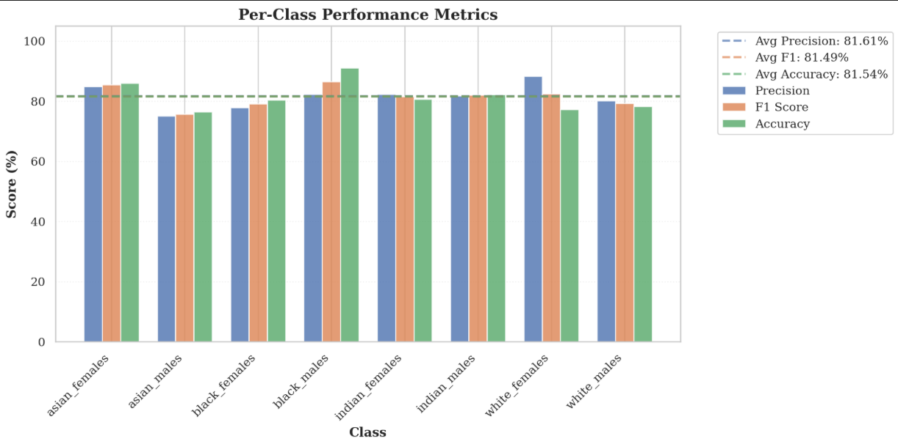
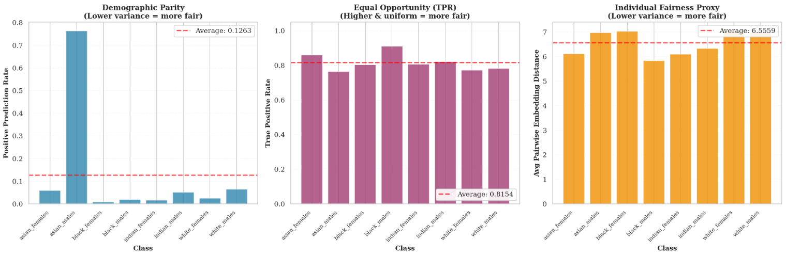
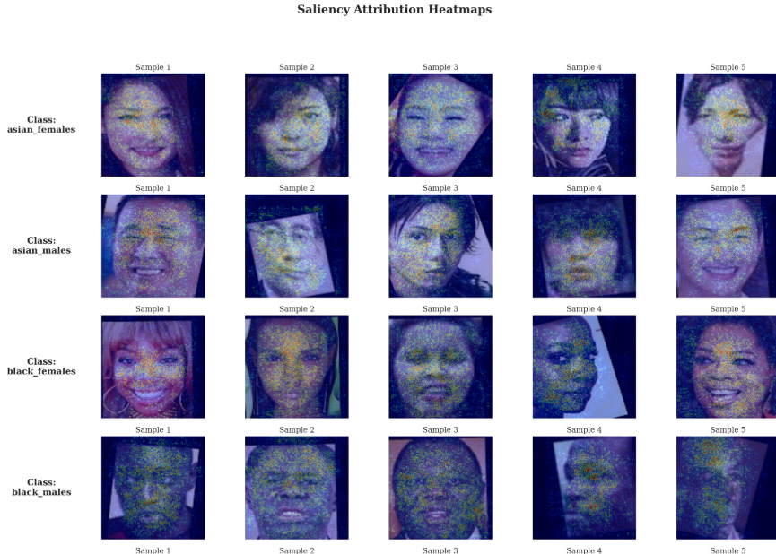

<!-- SLIDE 1 -->
# **Explainable AI and Facial Recognition**
 

**Group 5**
**Names:** Laia Domenech Burin, Sofiya Berdiyeva, Giulia Maria Petrilli, Fanus Ghorjani
**Date:**  12th December 2025

---
<!-- SLIDE - What is Explainable AI? -->

# What is Explainable AI?

- A set of processes that makes ML models and predictions **understandable** for humans  
- Needed in **high-stakes public policy** domains  
  (e.g., security, justice, healthcare, social welfare)
- Users are not only data scientists → also **authorities & decision-makers**
- Explanations must **support real decisions** and human accountability

---
<!-- SLIDE - Why Explainable AI matters -->
# Why Explainable AI matters

- In sensitive contexts, AI bias can cause **unequal treatment & human-rights violations**, especially for racialized groups (George, 2022)  
- Errors are not neutral → misclassifications decide **who passes, who gets stopped, who gets flagged** — risk of **discrimination by default**  
- In border & migration contexts, such systems work at the **border of rights**, risks of racism are particularly high  
- States have an obligation to protect people from discrimination by ensuring **regulation, oversight & transparency** of AI systems  
---
<!-- SLIDE - Policy Relevance -->

# Relevance for Policy Context

- Facial Recognition is increasingly used in **public security & border control**
- Example Germany: test deployments show risks of **surveillance, profiling and discriminatory misclassification** (Töper & Kleemann, 2025)
- Globally applied in migration & security contexts **without sufficient regulation** or fairness checks (Lynch, 2024)

> FRT can directly affect rights and freedom → bias becomes a **policy and human-rights issue**.

---
<!-- SLIDE - What is Fairness? -->

# What is Fairness?

- A model should **not systematically disadvantage** any person or demographic group
- Two main perspectives:
  - **Group Fairness** → equal treatment across protected groups
  - **Individual Fairness** → similar individuals receive similar outcomes
- Example: higher misclassification rates for Black persons in risk categorization  
  (Özmen Garibay & Gallegos, 2022)

> Fairness ensures **equity** in automated decision-making.
---
<!-- SLIDE 5 - Descriptives 1 -->

# Descriptives — Dataset Summary

- **8 demographic sub-groups**:
  - asian_females, asian_males  
  - black_females, black_males  
  - indian_females, indian_males  
  - white_females, white_males

- **2500** samples per group → **20,000 images** total
- Avg. dimensions: ~108×124 px
- Protected attribute: **Ethnicity × Gender**
---
<!-- Slide : Descriptives 2 -->
<!-- SLIDE - Descriptives 2 -->

# Descriptives — Visual Overview

- Representative **mean faces** per demographic subgroup  
  (Ethnicity × Gender)

> Noticeable visual variation across sub-groups

---
<!-- SLIDE - Metrics to Assess Bias (I) -->
# Metrics to Assess Bias (I)

- Precision
- Accuracy
- F1

---
<!-- SLIDE - Metrics to Assess Bias (I) -->
# Metrics to Assess Bias (I)

 In the `evaluate_fairness` function, we also compute: 

- **Demographic Parity:** 
    -  **ideal case:** all groups have same similar positive prediction rates. 
- **Equal Opportunity (TPR):** 
    - **ideal case:** all groups should have similar TPR.
- **Individual Fairness Proxy (Embedding Distance):** 
    - **ideal case:** all groups should have similar average embedding distances, indicating the model recognizes comparable levels of individual variation across groups and doesn't stereotype or homogenize any particular group.

---
<!-- SLIDE - Metrics to Assess Bias (II) -->
# Metrics to Assess Bias (II)

- Fairness across demographic groups assessed using:
  - **Demographic Parity (DP)**
  - **Equal Opportunity (TPR)**
  - **Individual Fairness Proxy**

  

> Takeaway: Model shows **clear group fairness disparities**.
---

<!-- SLIDE - Key Bias Findings -->
# Key Bias Findings

- **Big gap** in accuracy (~15pp)
- **Best:** Black males  
- **Worst:** Asian males / White males / White females  

- **DP violation:** Asian males → strong over-prediction  
- **TPR inequity:** White & Asian males disadvantaged  
- **Individual inconsistency:** Black & white females highest variation  

> Conclusion: Model is **not equitable** across demographic intersections.

---

<!-- SLIDE 8 -->

# Packages for Explainability

- After training our CNN, we analyze **how** it makes decisions  
- We use two XAI libraries:
  - **Xplique** → **feature attribution** & interpretability tools  
  - **eXplain-NNs** → **feature attribution** + latent representation insights
- Different models focus on different facial regions → can reveal **sources of bias**
- Explainability helps us **link performance disparities** to **model decision behavior**

> Goal: Make the model’s “black box” transparent and trace unfair outcomes to their cause

---

<!-- SLIDE 9 -->
# Xplique

## Attribution Methods

- Explain **which image regions** drive the model’s decision  
- Help detect **inconsistent or biased** feature use across groups  
- Different explainers reveal different perspectives → cross-checking increases reliability  

### Methods used in our analysis:
- **Saliency** → highlights sensitive pixels via gradients  
- **Integrated Gradients (IG)** → smoother & more reliable attribution  
- **SmoothGrad** → reduces noise by averaging multiple saliency maps  
- **Occlusion** → tests influence by masking image patches  

> Combining multiple explainers helps ensure robust and trustworthy interpretations.

---
<!-- SLIDE - Explain NNs -->

# Captum — Gradient-based Explainability

- Additional XAI library for **PyTorch**
- We use:
  - **Saliency** → highlights sensitive pixels
  - **Integrated Gradients** → reliable attribution along gradient paths
> IG helps validate whether the model consistently relies on meaningful facial regions.

- Focus on **bias across demographic groups**
- Images are preprocessed (resize → tensor → normalization)
  → ensures valid and consistent model inputs

> Captum helps us visually compare how the model uses features across groups.

--- 

# Bias Assessment — Qualitative Insights

- We combine **performance metrics** and **attribution results**
  to assess model behavior across groups
- Preliminary: based on **few qualitative examples** (≈ 5 per group)
- Findings are **exploratory**, not yet statistically validated
- Approach can be scaled for **systematic and quantitative** fairness evaluation

> Goal: detect early signs of biased decision behavior across demographic groups.

<!-- SLIDE — Saliency Attribution -->

## Qualitative Bias Assessment - Saliency Maps

- Highlight model-sensitive facial regions  
- Compare feature usage across demographic groups  
- Brighter = stronger influence on classification

--- 
# Saliency Maps — Groups 1–4

  

---
# Saliency Maps — Groups 5–8

  

--- 
# Bias assessment 

- Inconsistent feature attribution for Asian males and White females
- Limited reliance on facial periphery, especially for female examples
- Uneven or asymmetric activation for White males
- Group-specific deviations from the general IG pattern
---

<!-- SLIDE 11 (Optional) -->
# Thank You!
Questions?

--- 

# Sources
<!-- SLIDE — Bibliography -->

- Amarasinghe, K., Rodolfa, K., Lamba, H., & Ghani, R. (2020). *Explainable machine learning for public policy: Use cases, gaps, and research directions.* arXiv:2010.14374.

- Hu, S., Tian, J., Xie, H., & Liu, J. (2021). *Multidimensional face representation in a DCNN reveals the mechanism underlying AI racism.* Frontiers in Computational Neuroscience, 15. https://doi.org/10.3389/fncom.2021.620281

- Robinson, J. P., Livitz, G., Henon, Y., Qin, C., Fu, Y., & Timoner, S. (2020). Face Recognition: Too Bias, or Not Too Bias? (No. arXiv:2002.06483). arXiv. https://doi.org/10.48550/arXiv.2002.06483

- Lynch, J. (2024). *Bias and Biometrics: Regulating corporate responsibility and new technologies.*

- Özmen Garibay, O., & Gallegos, G. (2022). *Explainability and Fairness in Machine Learning.*
---
- Töper, M., & Kleemann, J. (2025). *Analyse: Polizeiliche Gesichtserkennung in Deutschland.*

- EU Commission. ETIAS & EES — AI in high-risk border control decision systems.
### XAI Tooling
- Tutorials—Xplique. (n.d.). Retrieved December 9, 2025, from https://deel-ai.github.io/xplique/latest/tutorials/

- eXplain-NNs — explainability toolkit for deep learning classification models.
---